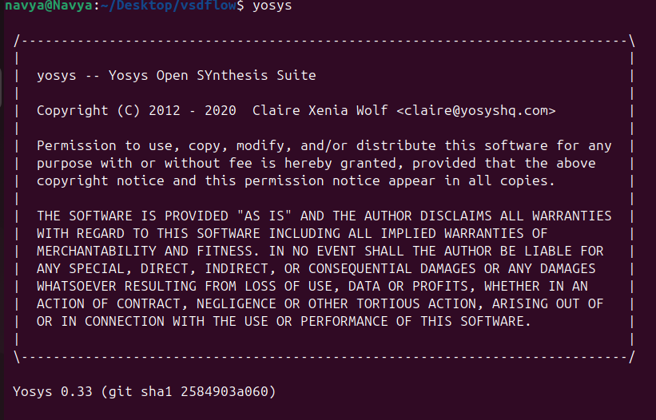
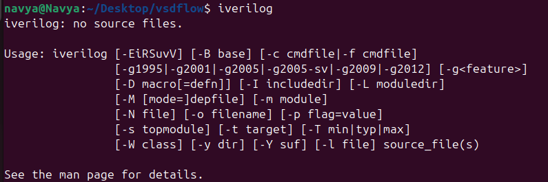
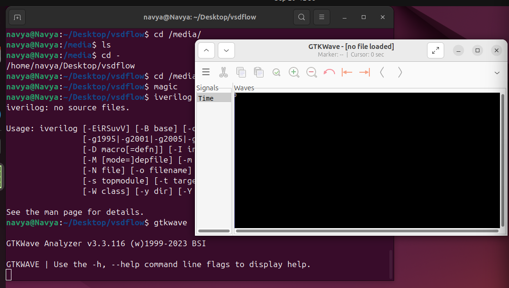

### **TASK 2 - System requirements & TOOLS INSTALLMENT**

###  **Install Oracle VirtualBox**

1. Download VirtualBox from the official website:  
   [VirtualBox Downloads](https://www.virtualbox.org/wiki/Downloads)
2. Install it using the downloaded installer:
   - *Windows / Mac:* Follow the graphical installer instructions.  
   - *Linux:* Use your package manager, e.g., for Ubuntu:  
     bash
     sudo apt-get update
     sudo apt-get install virtualbox
     

---

### System Requirements
- **Operating System**: Ubuntu 20.04 or higher
- **Memory (RAM)**: 6 GB minimum
- **Storage**: 50 GB HDD
- **CPU**: 4 vCPU (or equivalent multi-core processor)
---

### TOOLS Installation Instructions
#### **Yosys**

```bash
$ sudo apt-get update
$ git clone https://github.com/YosysHQ/yosys.git
$ cd yosys
$ sudo apt install make (If make is not installed please install it)
$ sudo apt-get install build-essential clang bison flex \
 libreadline-dev gawk tcl-dev libffi-dev git \
 graphviz xdot pkg-config python3 libboost-system-dev \
 libboost-python-dev libboost-filesystem-dev zlib1g-dev
$ make config-gcc
$ make
$ sudo make install
```


#### **Iverilog**
```bash
$ sudo apt-get update
$ sudo apt-get install iverilog
```

#### **gtkwave**
```bash
$ sudo apt-get update
$ sudo apt install gtkwave
```


